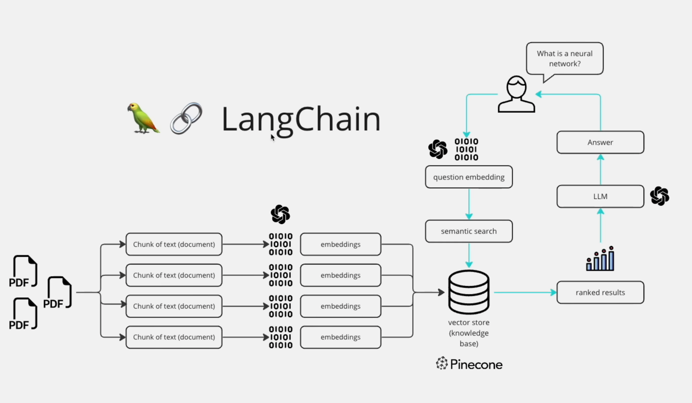

## Dependencies
* streamlit - for GUI
* pypdf2 - to read pdf files
* langchain - to interact with our language model
* python-dotenv - to load secrets from .env
* faiss-cpu - vector store
* openai
* huggingface_hub

## Running the application
> streamlit run main.py

## Flow diagram
